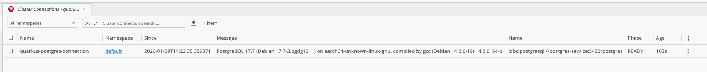

# AboutBits PostgreSQL Operator

## Getting started

These instructions will get you a copy of the project up and running on your local machine for development and testing purposes.

### Prerequisites

To build the project, the following prerequisites must be met:

- Java JDK (e.g. [OpenJDK](https://openjdk.java.net/))
- [Gradle](https://gradle.org/) (Optional)
- [Docker](https://www.docker.com/)

### Setup configuration

To get started, call:

```bash
make init
```

### Running the project in the console

You can run your application in dev mode that enables live coding and continuous testing using:

```shell script
make run

# or

./gradlew :operator:quarkusDev
```

The app service will be available at http://localhost:8080,
and you can also use the Dev UI (available in dev mode only) at <http://localhost:8080/q/dev/>.

To execute the test without continuous testing in the dev mode, you can run the following command:

```bash
make test

# or

./gradlew :operator:test
```

### Run the project as a service in IntelliJ

1. Open the `Services` tool on the left side of the IDE
2. Click on "+" and select "Quarkus"

Afterward, the project can be started in IntelliJ by navigating to `Run` -> `Run '...'`.

## Test the CRD on the ephemeral Dev Services cluster

This example demonstrates how to set up a local development environment using Quarkus Dev Services to test the Operator manually.
As the K3s cluster port and the secrets change on every `./gradlew :operator:quarkusDev` run, you will have to manually update the port and secrets in the `~/.kube/config` every time.

### 1. Configure Kubeconfig from Dev Services

When running in dev mode (`make run` or via IntelliJ), Quarkus starts the pre-configured K3s and PostgreSQL Dev Services.

1.  Access the Quarkus Dev UI at [http://localhost:8080/q/dev-ui/dev-services](http://localhost:8080/q/dev-ui/dev-services).
2.  Locate the properties for the `kubernetes-client` Dev Service.
3.  Convert these properties into a **Kubeconfig YAML** format, see the example below.
4.  Merge this configuration into your local `~/.kube/config`. This allows your local environment to communicate with the ephemeral Kubernetes cluster provided by Dev Services.

```yml
apiVersion: v1
kind: Config
current-context: quarkus-cluster
clusters:
- cluster:
    certificate-authority-data: LS0tLS1CRUdJTiBDRVJUSUZJQ0FURS0tLS0tCk1JSUJkekNDQVIyZ0F3SUJBZ0lCQURBS0JnZ3Foa2pPUFFRREFqQWpNU0V3SHdZRFZRUUREQmhyTTNNdGMyVnkKZG1WeUxXTmhRREUzTmpjNU56UTFNREF3SGhjTk1qWXdNVEE1TVRZd01UUXdXaGNOTXpZd01UQTNNVFl3TVRRdwpXakFqTVNFd0h3WURWUVFEREJock0zTXRjMlZ5ZG1WeUxXTmhRREUzTmpjNU56UTFNREF3V1RBVEJnY3Foa2pPClBRSUJCZ2dxaGtqT1BRTUJCd05DQUFRYlpRQmgzdlNXMVExd1pST0tBQ1NlY3dreXhQUXVjVm9FN0tVM1MrQnYKZ1hJYzdCREQrb2JqTXFETXZuRkpNUlBCYUw0R2RDVVNsRDM3QzJUV01DNjlvMEl3UURBT0JnTlZIUThCQWY4RQpCQU1DQXFRd0R3WURWUjBUQVFIL0JBVXdBd0VCL3pBZEJnTlZIUTRFRmdRVURPdkI4eWt1VFJBTDRjRjhNOUo4Cit3STh5U2t3Q2dZSUtvWkl6ajBFQXdJRFNBQXdSUUlnQWlZb0RsR2txUXd6WXVzcno5V3RMcUdEMXE2SmR6TVYKdW1nTFFPeFdNTEFDSVFDenQyMmxVTXJMNm1zMnBSRTBpQmZ3azNLbGdKSmJzZkp0YlI0bW9mRE16UT09Ci0tLS0tRU5EIENFUlRJRklDQVRFLS0tLS0K
    server: https://localhost:53658
  name: quarkus-cluster
# ... more clusters
contexts:
- context:
    cluster: quarkus-cluster
    namespace: default
    user: quarkus-user
  name: quarkus-context
# ... more contexts
users:
- name: quarkus-user
  user:
    client-certificate-data: LS0tLS1CRUdJTiBDRVJUSUZJQ0FURS0tLS0tCk1JSUJrakNDQVRlZ0F3SUJBZ0lJTlpCUDhySWZaTlV3Q2dZSUtvWkl6ajBFQXdJd0l6RWhNQjhHQTFVRUF3d1kKYXpOekxXTnNhV1Z1ZEMxallVQXhOelkzT1RjME5UQXdNQjRYRFRJMk1ERXdPVEUyTURFME1Gb1hEVEkzTURFdwpPVEUyTURFME1Gb3dNREVYTUJVR0ExVUVDaE1PYzNsemRHVnRPbTFoYzNSbGNuTXhGVEFUQmdOVkJBTVRESE41CmMzUmxiVHBoWkcxcGJqQlpNQk1HQnlxR1NNNDlBZ0VHQ0NxR1NNNDlBd0VIQTBJQUJIdnE1UWxVWVBFRldvYXEKRTJNRXI1cUM4TjBFMVkyRTJBTDcrYUl0a1YzYWZHRkkyMGtBODl1eEorc1phQ0ZzblJzYmE1ZmtuVEhPaGJtOApYZGpSeERxalNEQkdNQTRHQTFVZER3RUIvd1FFQXdJRm9EQVRCZ05WSFNVRUREQUtCZ2dyQmdFRkJRY0RBakFmCkJnTlZIU01FR0RBV2dCUWJ3RktrRXhOaitCZjl2YVVNSGxtUi9oeC9PekFLQmdncWhrak9QUVFEQWdOSkFEQkcKQWlFQXlncll6eFIrZWoxWk5CdGdsZW5WT01HWWYrRWlPbkR6L1dzK1dQc1hnd0VDSVFEcEZhMlJ2RkRIVXhLMwpEODkzcGNLUkt1eU5MdXp6ZVZGODNlMURpckF1ZXc9PQotLS0tLUVORCBDRVJUSUZJQ0FURS0tLS0tCi0tLS0tQkVHSU4gQ0VSVElGSUNBVEUtLS0tLQpNSUlCZGpDQ0FSMmdBd0lCQWdJQkFEQUtCZ2dxaGtqT1BRUURBakFqTVNFd0h3WURWUVFEREJock0zTXRZMnhwClpXNTBMV05oUURFM05qYzVOelExTURBd0hoY05Nall3TVRBNU1UWXdNVFF3V2hjTk16WXdNVEEzTVRZd01UUXcKV2pBak1TRXdId1lEVlFRRERCaHJNM010WTJ4cFpXNTBMV05oUURFM05qYzVOelExTURBd1dUQVRCZ2NxaGtqTwpQUUlCQmdncWhrak9QUU1CQndOQ0FBVGNWU1NCOHdNakJIbHVOekVZb2krUUU1di9iUWl3cS81d2Jtb2hKU0FGCmZ2aE95eUhCcDBweDRRR0l6YU5BVm9kdkFIazRFV0ViMy9sMWpZVXNCSGlTbzBJd1FEQU9CZ05WSFE4QkFmOEUKQkFNQ0FxUXdEd1lEVlIwVEFRSC9CQVV3QXdFQi96QWRCZ05WSFE0RUZnUVVHOEJTcEJNVFkvZ1gvYjJsREI1WgprZjRjZnpzd0NnWUlLb1pJemowRUF3SURSd0F3UkFJZ2FJemlrUzN6THNSakZTdit1Ny9BbmRNQzdDWTZaREF4Ckp4T1pKbzJVTmVRQ0lFaVlLQlpEVjhVZDZHN3BGU2doSVU5UVZYQ3FYSmx6MHNRbWpnRTJUeUZHCi0tLS0tRU5EIENFUlRJRklDQVRFLS0tLS0K
    client-key-data: LS0tLS1CRUdJTiBFQyBQUklWQVRFIEtFWS0tLS0tCk1IY0NBUUVFSUFuN1dTOWJGZUhlaUpKMmJHcHFFTjBJc28vQzR3VEVNRFBSdENRNzNYMmhvQW9HQ0NxR1NNNDkKQXdFSG9VUURRZ0FFZStybENWUmc4UVZhaHFvVFl3U3Ztb0x3M1FUVmpZVFlBdnY1b2kyUlhkcDhZVWpiU1FEegoyN0VuNnhsb0lXeWRHeHRybCtTZE1jNkZ1YnhkMk5IRU9nPT0KLS0tLS1FTkQgRUMgUFJJVkFURSBLRVktLS0tLQo=
# ... more users
```

### 2. Create PostgreSQL Connection and Secret

For the `postgresql` Dev Service, you can generate the necessary Custom Resources to test the Operator:

1.  From the Dev UI, get the `postgresql` Dev Service properties (username, password, host, port).
2.  Convert the `postgresql` Dev Service properties to a **Basic Auth Secret** and a **ClusterConnection** CR instance.
    For more details see class `ClusterConnectionSpec` or the `ClusterConnection` CRD definition from `build/kubernetes/clusterconnections.postgresql.aboutbits.it-v1.yml` as a reference.
3.  Apply the generated files using IntelliJ or `kubectl`.
    

**Example Secret (`secret.yml`):**

```yaml
apiVersion: v1
kind: Secret
metadata:
  name: quarkus-db-secret
  labels:
    app.kubernetes.io/name: quarkus-postgres
type: kubernetes.io/basic-auth
stringData:
  # extracted from quarkus.datasource.username
  username: root
  # extracted from quarkus.datasource.password
  password: password
```

**Example ClusterConnection (`cluster-connection.yml`):**

```yaml
apiVersion: postgresql.aboutbits.it/v1
kind: ClusterConnection
metadata:
  name: quarkus-postgres-connection
spec:
  adminSecretRef:
    name: quarkus-db-secret
  host: localhost
  port: 5432
  maintenanceDatabase: postgres
```



### 3. Create a Role

Similarly, you can create a `Role` resource:

1.  Manually create a **Role** CR instance. 
    For more details see class `RoleSpec` or the `Role` CRD definition from `build/kubernetes/roles.postgresql.aboutbits.it-v1.yml` as a reference.
2.  Apply the file using IntelliJ or `kubectl`.

**Example Role (`role.yml`):**

```yaml
apiVersion: postgresql.aboutbits.it/v1
kind: Role
metadata:
  name: test-role-from-crd
spec:
  # The actual name of the role to be created in the PostgreSQL database
  name: test-role-from-crd
  comment: It simply works
  # Connects this role definition to the specific Postgres ClusterConnection CR instance
  clusterRef:
    name: quarkus-postgres-connection
  flags:
    createdb: true
    validUntil: "2026-12-31T23:59:59Z"
```


## Packaging and running the application

The application can be packaged using:

```shell script
./gradlew :operator:build
```

It produces the `quarkus-run.jar` file in the `build/quarkus-app/` directory.
Be aware that it’s not an _über-jar_ as the dependencies are copied into the `build/quarkus-app/lib/` directory.

The application is now runnable using `java -jar build/quarkus-app/quarkus-run.jar`.

If you want to build an _über-jar_, execute the following command:

```shell script
./gradlew :operator:build -Dquarkus.package.jar.type=uber-jar
```

The application, packaged as an _über-jar_, is now runnable using `java -jar build/*-runner.jar`.

## Creating a native executable

You can create a native executable using:

```shell script
./gradlew :operator:build -Dquarkus.native.enabled=true
```

Or, if you don't have GraalVM installed, you can run the native executable build in a container using:

```shell script
./gradlew :operator:build -Dquarkus.native.enabled=true -Dquarkus.native.container-build=true
```

You can then execute your native executable with: `./build/postgresql-operator-1.0.0-SNAPSHOT-runner`

If you want to learn more about building native executables, please consult <https://quarkus.io/guides/gradle-tooling>.

## Related Guides

- Operator SDK ([guide](https://docs.quarkiverse.io/quarkus-operator-sdk/dev/index.html)): Quarkus extension for the Java Operator SDK (https://javaoperatorsdk.io)
- Helm ([guide](https://docs.quarkiverse.io/quarkus-helm/dev/index.html)): Quarkus extension for Kubernetes Helm charts
- SmallRye Health ([guide](https://quarkus.io/guides/smallrye-health)): Monitor service health
- Micrometer metrics ([guide](https://quarkus.io/guides/micrometer)): Instrument the runtime and your application with dimensional metrics using Micrometer.
- YAML Configuration ([guide](https://quarkus.io/guides/config-yaml)): Use YAML to configure your Quarkus application
